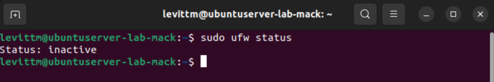
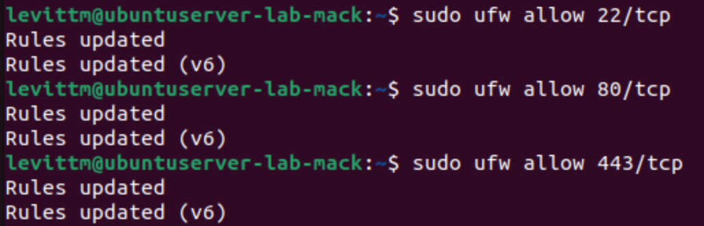
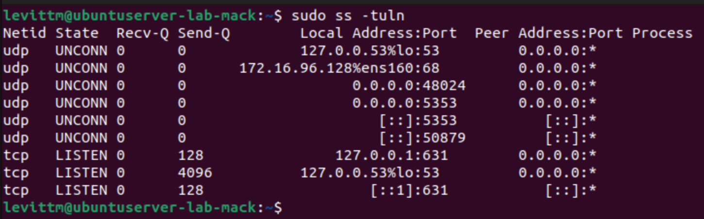
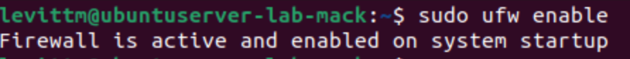
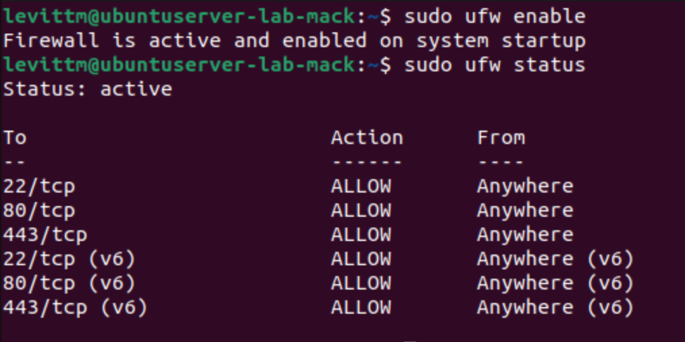
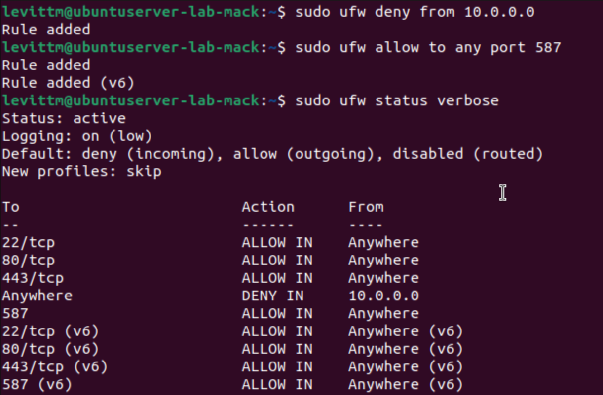
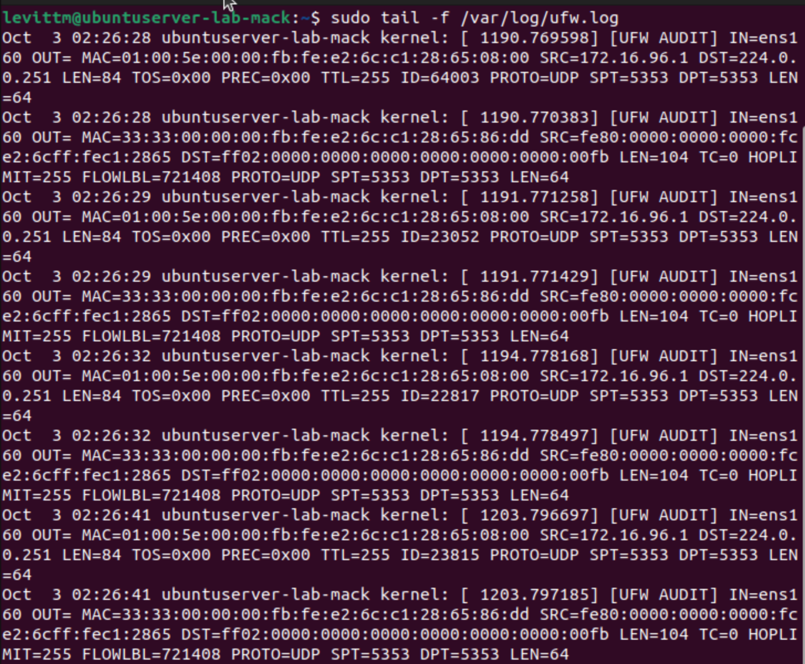
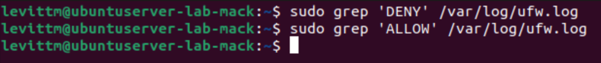

# Lab Description

    This lab was completed in October 2025. Here, I explore firewalls in my virtual machine, and test how to change permissions/interpret log reports and status changes. 

## Lab

### Checking Status of Firewall

    Here is the status of my firewall before starting this lab, which shows that it is inactive.

### Allowing Port Access/Checking Which Ports are Active

    These screenshots show the process of allowing access to ports 22, 80, and 443. Port 22 allows connection to SSH, port 80 allows HTTP traffic and port 443 allows HTTPS traffic. I then used the sudo ss -tuln command to check the states and ports that are open on my machine. 

### Enabling my Firewall and its Status

    In this part of the lab, I turned my firewall on and checked to see which ports the firewall would allow traffic from. 

### Changing/Granting Permissions

    To further test and explore with my firewall, I played around with giving different ports and IP addresses access through the firewall. 

### Checking my logs

    Here, I checked the log of my firewall and tried to trace where each entry came from. All of the entries were marked as audits, so I know no packets were denied in this process. All of the entries came from the same source port and went to the exact same destination, so I know that all of these entries were from my earlier commands!

### Filtering Specific Entries Using Grep

    Finally, I filtered the entries in my log depending on if they were denied or allowed access. Since nothing came up for either, no packets or data was specifically denied or allowed entry through my firewall, which makes sense from my earlier log. 

 