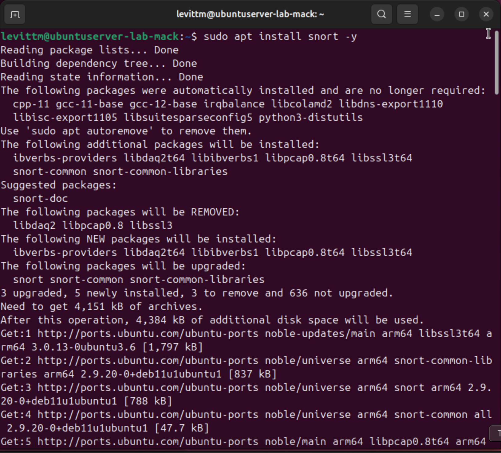
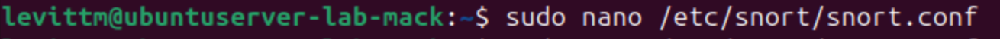
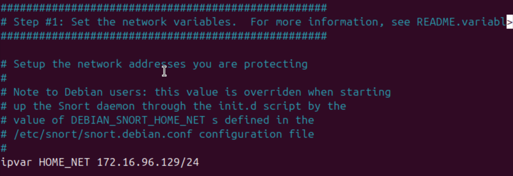
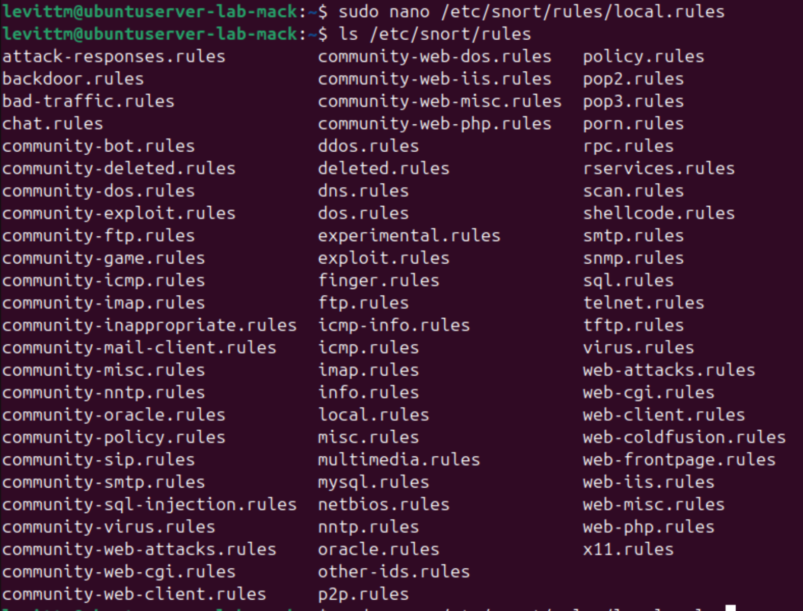
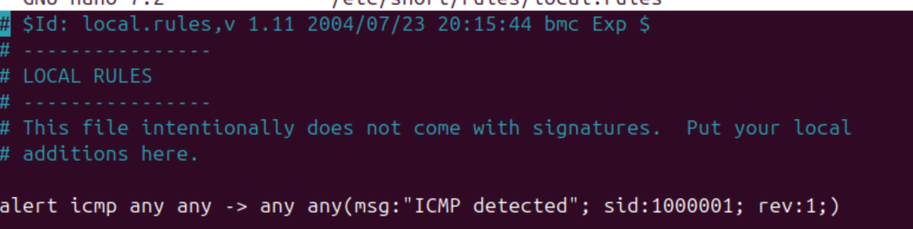
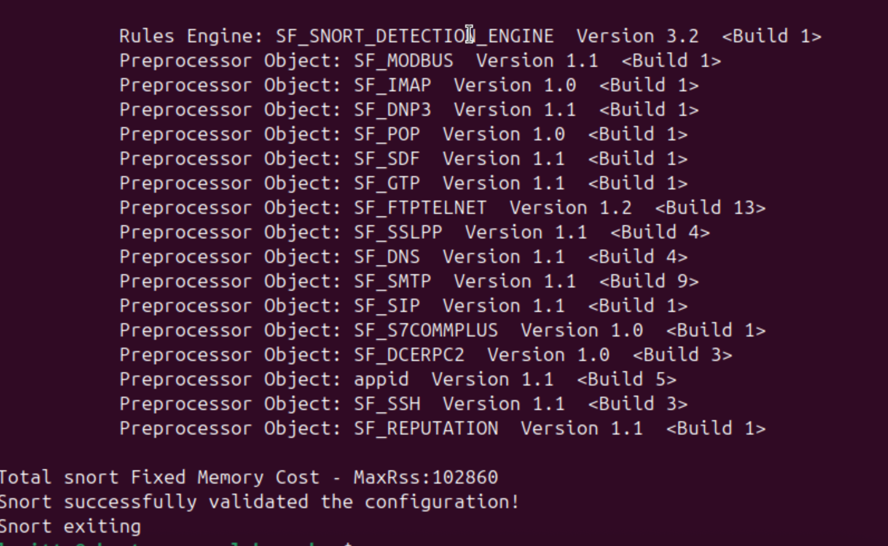
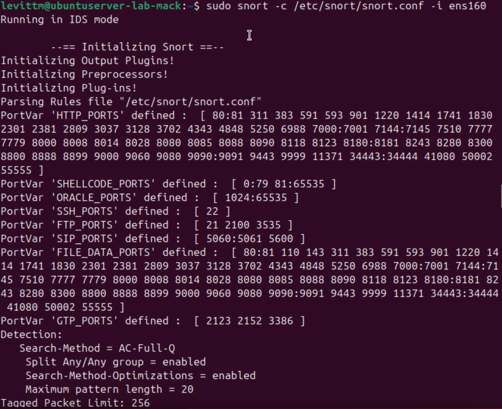
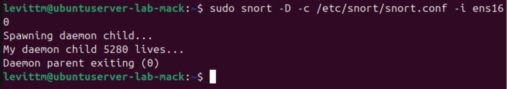

# Lab Description
    This lab was completed in October 2025. Throughout this assignment, I installed Snort onto my virtual machine and tested out its various tools.  

## Lab

### Updating my system/Installing Snort

    Here I simply have the process of installing Snort onto my virtual machine. It didn't take longer than a few seconds, and the setup (in the next step) was very simple.

### Configuring Snort

To set Snort to listen to my own designated home network. I also spent some time scrolling through the other settings I could customize. There were so many! If I was in charge of a large server, I'd definitely want as much customization as Snort seems to offer for any situation I'd come across.

### Managing/Testing rules

Next, I explored Snort's rule directory and saw it included a pretty comprehensive list of common cybersecurity attacks. I also added a custom rule to the local rules that will help me determine if Snort was actually working. Here, Snort should detect any pings or packet requests on my server.

### Running in IDS Mode

To keep monitoring traffic on my server, I activated IDS mode to passively listen to traffic. This would alert me to any issues but it doesn't provide any blocks or deterrents. 

### Running Snort as a daemon

Finally, I ran Snort as a daemon, which would keep Snort running in the background. This would be useful when nobody is physically able to monitor the network; it provides constant consistent threat detection. To disable the daemon, I used the command "sudo pkill snort," terminating all of the Snort operations at once. 