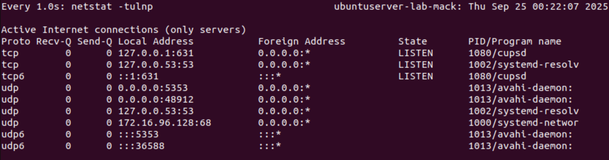

# Lab Description

    This lab was completed in September 2025. Here, I play with basic commands on my server's network, examine the environment of my network, and analyze vulnerabilities that I will return to later in the course.

## Lab

### Identify Network Interfaces and IP Addresses

    Here, my list of network interfaces and IP addresses is displayed. 

### Check Open Ports

    This command listed all open ports on my server, as well as which services are listening in. I can use this list to close any unneccessary open ports and tighten my security. 

### Analyze Network Connections

    This is a list of all my open network connections, which I can go through and validate that each is a known and authorized connection.

### Perform Network Scanning with Nmap

    This command shows what operating system my network is running on, ports that are open and closed, and other running services.

### Check for Open Ports on the Server's Network

    This screenshot was cut off, as the command reported back about 256 hosts that were up. Since this command was supposed to identify all live hosts on my local network, this might be a (concerning) success. I will definitely be revisiting this to inspect what happened here.

### Check for Services and Versions

    Here, I was detecting which services and versions are running on each port. I only have one port open, so it is pretty straightforward to interpret.

### Identify Potential Vulnerabilities

    This command was trying to find known vulnerabilities on my server. There were a few script execution failed errors, and I am likely vulnerable to a Slowloris DOS attack. In the coming weeks, I will aim to fix these vulnerabilities.

### Inspect Network Traffic

    This tool monitors the network traffic on my interface ens160. As I am the only person in my house on my ubuntu server, it makes sense that every entry/packet captured is a known entity.

### Monitor Network Connections in Real-Time

    In contrast to the last command, this tool updates with network connections every second. If I were in charge of network security of a company, this live feed would be helpful to catch suspicious activity and keeping me informed.

### Check Firewall Rules

    This command is simply checking the status of my current firewall rules. Since I don't currently have a firewall set up, nothing is shown.